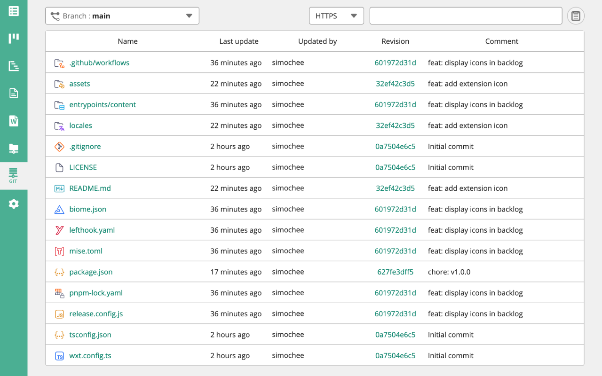

<h1 align="center">File Icons for Backlog Git</h1>

Backlog Git にファイルアイコンを表示するブラウザ拡張機能

## 💿 インストール

[link-chrome]: https://chromewebstore.google.com/detail/aeejnngbcaakhmbcllihmpfijmgaecia 'Chrome Web Store'
[link-firefox]: https://addons.mozilla.org/ja/firefox/addon/file-icons-for-backlog-git/ 'Firefox Browser Add-ons'

[][link-chrome]
[][link-chrome]

> 対応ブラウザ：
[][link-chrome]
[][link-chrome]
[][link-chrome]
[][link-chrome]

[][link-firefox]
[][link-firefox]

> 対応ブラウザ：
[][link-firefox]

## 🛡️ ライセンス

MIT License
